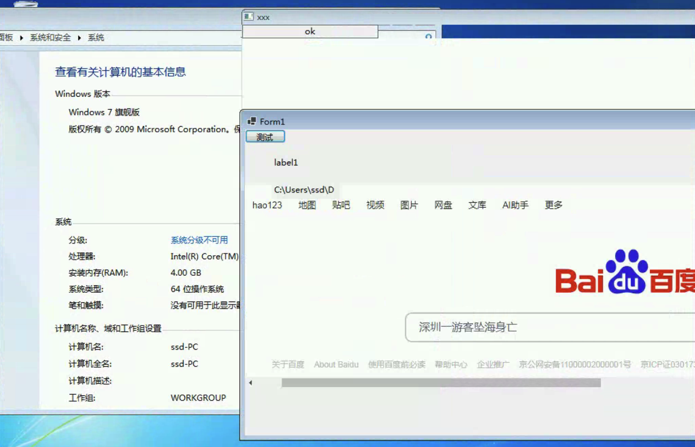
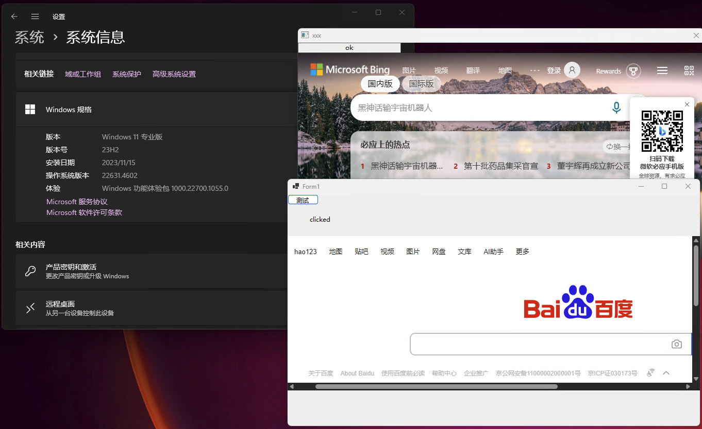

# 项目介绍

此项目为webview2在windows环境下的AOT项目，共有2种实现
### win32 api / winforms

**NOTE:** 此项目为C#实现，win32方式目前不支持win7，但可部署除webivew外的功能。win32优点体积小速度快
| 方式 | 体积 | 
| :-----| ----: | 
| win32api | 3.78M | 
| winforms | 19.4M | 

## 发布项目
执行脚本 publish.bat/publish-arm64.bat

## 测试截图
### win7

### win11
